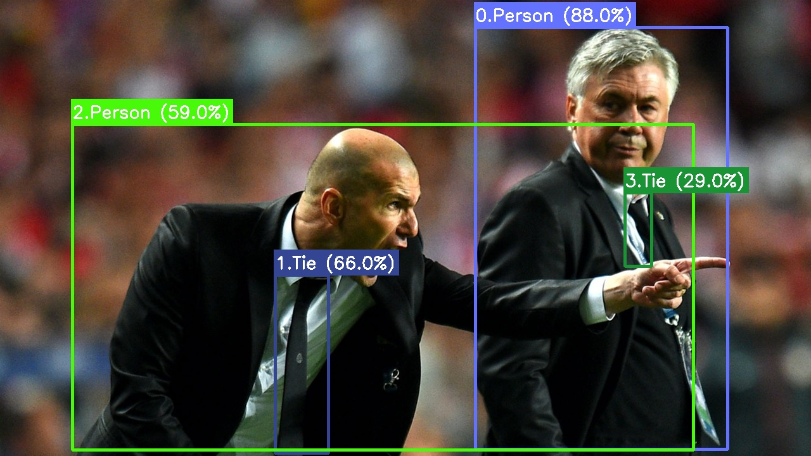
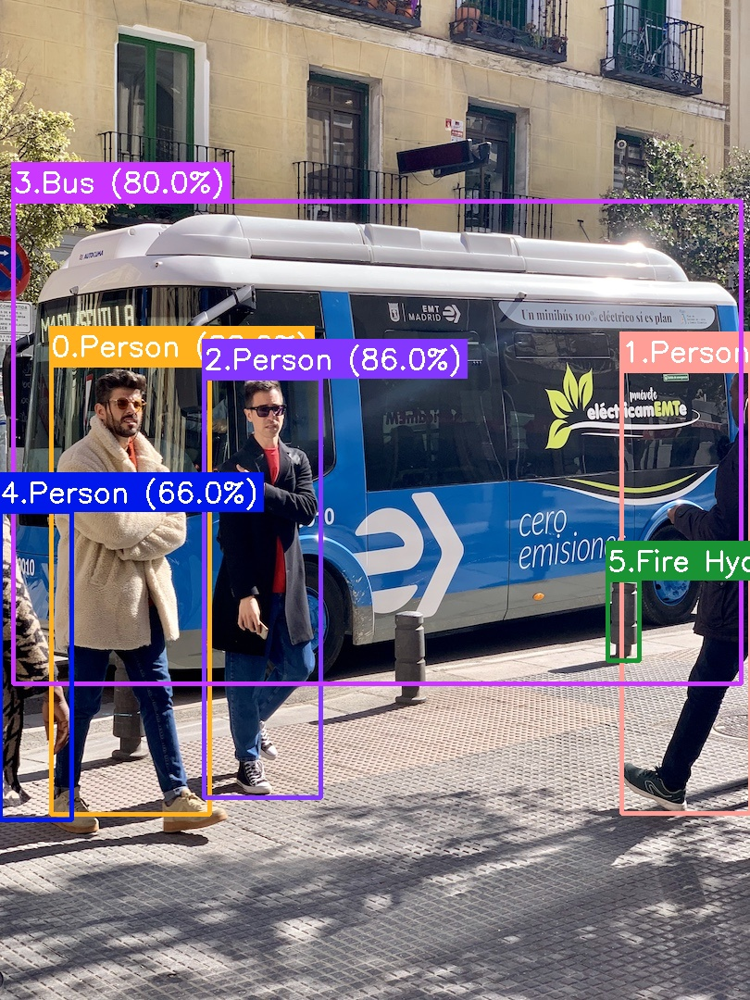
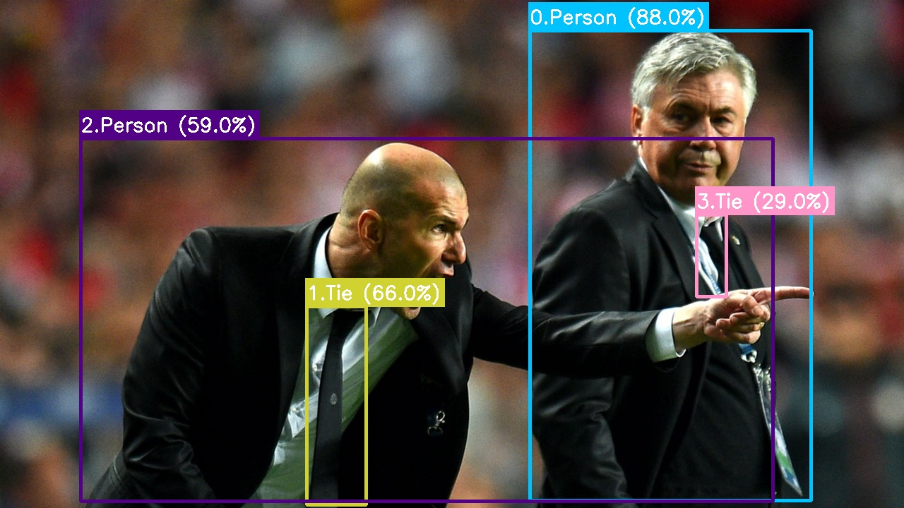
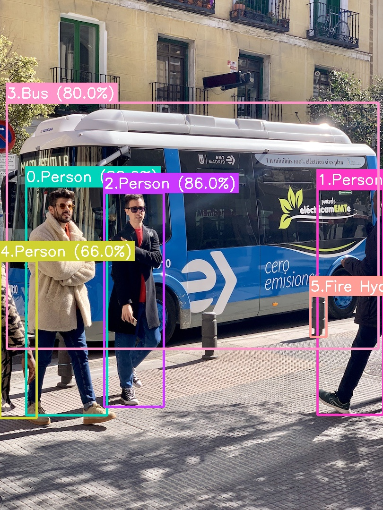
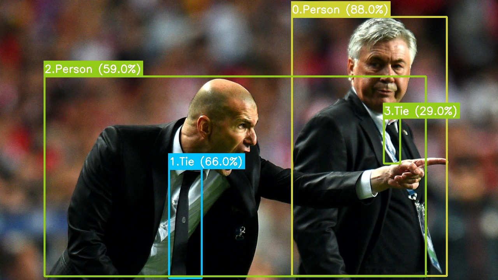
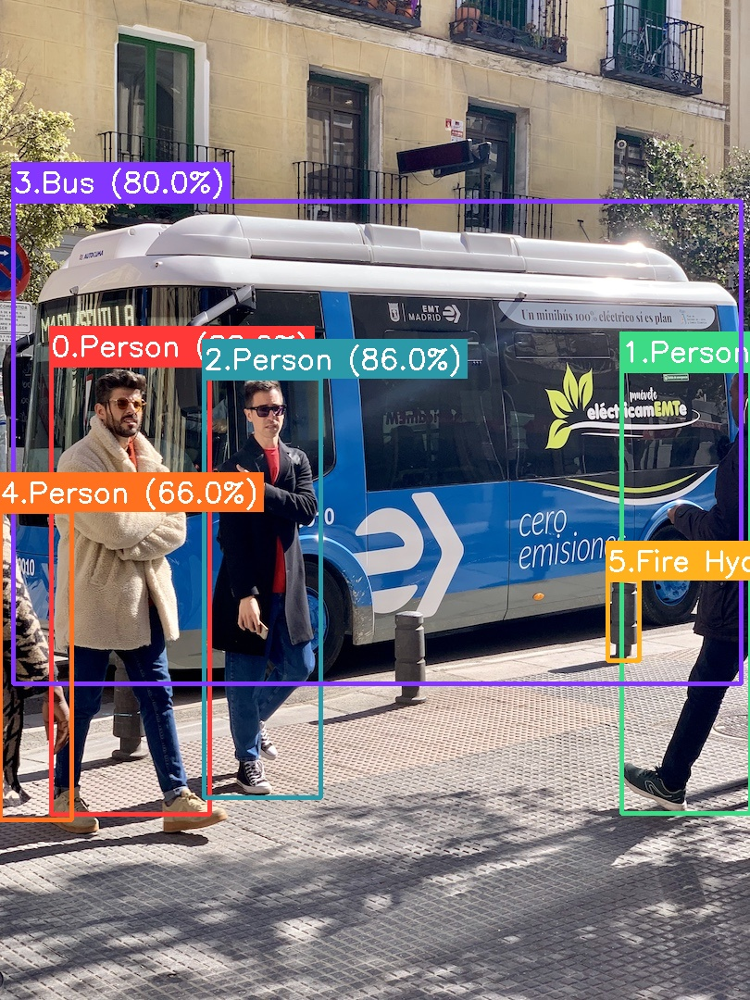
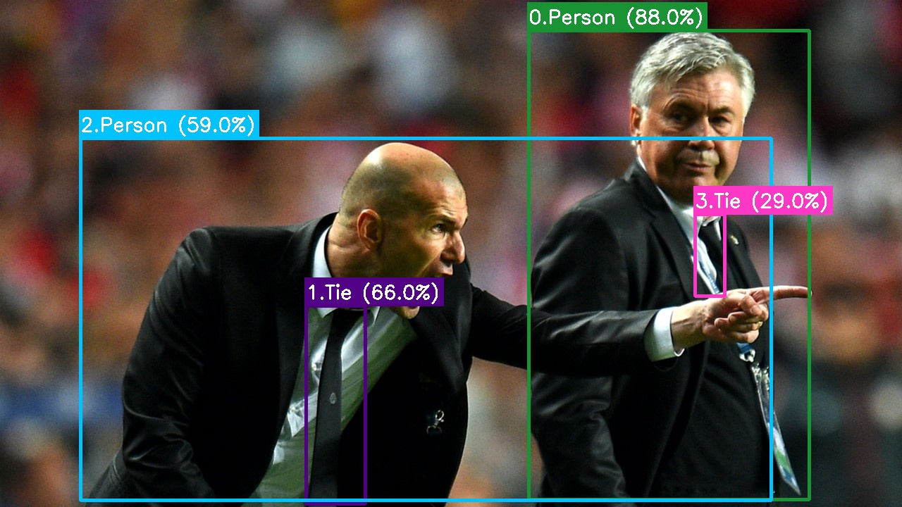
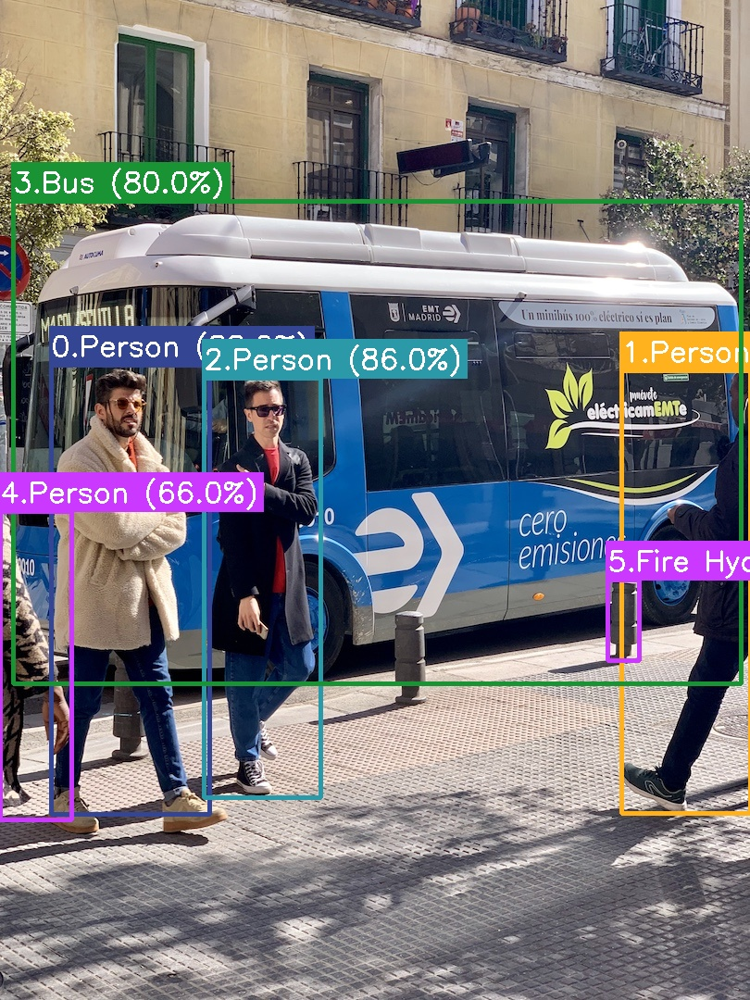

#  CVU: Computer Vision Utils

[](https://www.codefactor.io/repository/github/bluemirrors/cvu) [](https://github.com/mkenney/software-guides/blob/master/STABILITY-BADGES.md#alpha)
[](https://www.python.org/) [](https://pepy.tech/project/cvu-python) [](https://colab.research.google.com/drive/1FvebFw40Bm0bUHWCgS0-iuYp8AKLIfSh?usp=sharing)


<br>

Computer Vision deployment tools for dummies and experts.<br>

```bash
pip install cvu-python
```

<br>

✨✨
CVU  is participating in 🚀 [Yolov5's export competition](https://github.com/ultralytics/yolov5/discussions/3213) 🚀. Please checkout our and other's great submissions, and maybe consider voting by giving 👍 &nbsp; on our submissions!

[Nvidia-Jetson-Nano-Submission](https://github.com/ultralytics/yolov5/discussions/3426#discussioncomment-1116707) | [Intel/AMD CPU-Submission](https://github.com/ultralytics/yolov5/discussions/3432#discussioncomment-1116718) | [Google Edge TPU-Submission](https://github.com/ultralytics/yolov5/discussions/3428#discussioncomment-1116728)✨✨

<br>

# Index 📋

- [Getting Started](#cvu-says-hi-) [](https://colab.research.google.com/drive/1FvebFw40Bm0bUHWCgS0-iuYp8AKLIfSh?usp=sharing)
- [What and why is CVU?](#why-cvu-)
- [Object Detection (Yolov5)](#yolov5-object-detection) [](https://colab.research.google.com/drive/1FvebFw40Bm0bUHWCgS0-iuYp8AKLIfSh?usp=sharing)
  - [TensorRT](#tensorrt)
  - [Torch](#torch)
  - [ONNX](#onnx)
  - [TensorFlow](#tensorflow)
  - [TFLite](#tflite)
- [Devices (CPU, GPU, TPU)](#devices)
- [Benchmark-Tool (Yolov5)](#benchmarks-yolov5)
- [Benchmarks Results (Yolov5)](#yolov5-benchmark-results)
- [Precission Accuracy (Yolov5)](#precission-accuracy-yolov5))
- [Examples](https://github.com/BlueMirrors/cvu/tree/master/examples)
- [References](#references)

<br>

# CVU  Says Hi!

[Index](#index-)

Whether you are developing an optimized computer vision pipeline or just looking to use some quick computer vision in your project, CVU  can help! Designed to be used by both the experts and the novice, CVU  aims at making CV pipelines easier to build and consistent around platforms, devices and models.<br><br>

For example, how much installation-steps and code would you need to run object detection on a video with a TensorRT backend? How complicated can it be to test that pipeline out in Colab?<br><br>

With CVU , you just need the following! No extra installation steps needed to run on Colab, just pip install our tool, and you're all set to go!<br>

```python
from vidsz.opencv import Reader, Writer
from cvu.detector import Detector

# set video reader and writer, you can also use normal OpenCV
reader = Reader("example.mp4")
writer = Writer(reader, name="output.mp4")


# create detector
detector = Detector(classes="coco", backend="tensorrt")

# process frames
for frame in reader:

    # make predictions.
    preds = detector(frame)

    # draw it on frame
    preds.draw(frame)

    # write it to output
    writer.write(frame)

writer.release()
reader.release()

```

<br>

Wants to use even less lines of code? How about this! <br>

```python
from cvu.detector import Detector
from vidsz.opencv import Reader, Writer

detector = Detector(classes="coco", backend="tensorrt")


with Reader("example.mp4") as reader:
    with Writer(reader, name="output.mp4") as writer:
        writer.write_all(map(lambda frame:detector(frame).draw(frame), reader))
```

<br>

Want to switch to non-cuda devic? Just set `device="cpu"`, and backend to `"onnx"`, `"tflite"`, `"torch"` or `"tensorflow"`.

<br>

```python
detector = Detector(classes="coco", backend="onnx", device="cpu")
```

<br>

Want to use TPU? Just set `device="tpu"` and choose a supported backend (only `"tensorflow"` as of the latest release)

<br>

```python
detector = Detector(classes="coco", backend="tensorflow", device="tpu")
```

You can change device, platforms and backends as much as you need and want, without having to change your main pipeline.
<br><br>

# Why CVU ?

[Index](#index-)

There are countless great open-source state-of-the-art computer vision models that are pushing Computer Vision field ahead every moment. But many of them are either too complicated or hard to use in deployment scenario or to integrate in simple projects.

CVU  can handle all the Computer vision related stuff (even installation of the required frameworks/libraries in most cases), while you can focus on building awesome projects!!

We are working to optimize open source state-of-the-art models for various CV use cases, and aim to make them more accessible and available to everyone!
<br> <br>

# Yolov5 Object Detection

[Index](#index-)

```python
from cvu.detector import Detector
detector = Detector(classes="coco", backend = "torch",
                    weight = "yolov5s", device = "auto"))
```

Detector Arguments

- `classes (Union[str, List[str]])`: name of classes to be detected.
  It can be set to individual classes like 'coco', 'person', 'cat' etc.
  Alternatively, it also accepts list of classes such as ['person', 'cat'].
  For default models/weights, 'classes' is used to filter out objects
  according to provided argument from coco class. For custom models, all
  classes should be provided in original order as list of strings.

- `backend (str, optional)`: name of the backend to be used for inference purposes.
  Defaults to "torch".

- `weight (str, optional)`: path to weight files (according to selected backend).
  Alternatively, it also accepts identifiers (such as yolvo5s, yolov5m, etc.)
  to load pretrained models. Defaults to "yolov5s".

- `device (str, optional)`: name of the device to be used. Valid
  devices can be "cpu", "gpu", "cuda", "tpu", "auto". Defaults to "auto" which tries
  to use the device best suited for selected backend and the hardware avaibility.

<br>

Every object detector expects BGR formatted single image (batching is not supported yet), and returns a [Predictions](https://github.com/BlueMirrors/cvu/blob/master/cvu/detector/predictions.py) object which represents a group/list of detected objects. You can access individual detections using indexing or looping through [Predictions](https://github.com/BlueMirrors/cvu/blob/master/cvu/detector/predictions.py). A single detection is represented by [Prediction](https://github.com/BlueMirrors/cvu/blob/master/cvu/detector/prediction.py).

```python
import cv2
from cvu.detector import Detector

# read image, initiate detector
img = cv2.imread("example.jpg")
detector = Detector(classes="coco")

# inference
predictions = detector(img)

# predictions info
print(predictions)

# draw on frame (inplace + returns img)
predictions.draw(img)

# class-wise counter object
print(predictions.count())

# loop through
for prediction in predictions:
    # print info
    print(prediction)

    # access specific things
    print(prediction.bbox, prediction.confidence)
    print(prediction.class_id, prediction.class_name)

    # draw specific prediction (only inplace, doesn't return img)
    prediction.draw(img)

# save img
cv2.imwrite("output.jpg", img)
```

These wrappers around detections provides various functionalities for drawing boxes, accessing detection info (individually as well as a group). And they implement CVU's common [predictions interface](https://github.com/BlueMirrors/cvu/blob/master/cvu/interface/predictions.py) for consistency.

<br>

Every Object detectors is implemented in `cvu.detector`, following a common [interface](https://github.com/BlueMirrors/cvu/blob/master/cvu/interface/core.py).

As of our first alpha release, we only support `Yolov5s` models.

<br>

# Yolov5

[Index](#index-)

[Yolov5](https://github.com/BlueMirrors/cvu/blob/master/cvu/detector/yolov5/core.py) is one of the state of the art Object Detection models. Please check out more about it and train your own custom models through it's [official repo](https://github.com/ultralytics/yolov5). CVU also supports custom weights for all the backends.

Checkout following backends for more specific information

- [TensorRT (NVIDIA-GPU)](#tensorrt)
- [ONNX (GPU, CPU)](#onnx)
- [Torch (GPU, CPU)](#torch)
- [TensorFlow (GPU, CPU, TPU)](#tensorflow)
- [TFLite (CPU)](#tflite)

<br>

# TensorRT

[Index](#index-)

(Only supported for NVIDIA-GPUs, Tested on Linux Devices, Partial Dynamic Support)

You can use TensorRT powered detector by specifying the backend parameter.

```python
from cvu.detector import Detector
detector = Detector(classes="coco", backend = "tensorrt"))
```

Internally, Detector will build TensorRT Cuda-Engine using pretrained ONNX Yolov5s weight file.

If you want to run detector for your custom weights, simply do following

- [Train Yolov5 on your custom dataset](https://github.com/ultralytics/yolov5/wiki/Train-Custom-Data)
- [Export Weights PyTorch weights to ONNX](https://github.com/ultralytics/yolov5/blob/master/export.py)

Make sure you use the `---dynamic` flag while exporting your custom weights.

```bash
python export.py --weights $PATH_TO_PYTORCH_WEIGHTS --dynamic --include onnx
```

Now simply set parameter `weights="path_to_custom_weights.onnx` in Detector initialization, and you're ready for inference.

<br>
Notes

- Unlike other backends, TensorRT backend is not fully dynamic (for optimization reasons). You can initiate Detector and inference on any shape of image and it'll setup engine's input shape to the first input's shape. To run inference on a different shaped image, you'll have to create new detector.

- Building TensorRT Engine and first inference can take sometime to complete (specially if it also has to install all the dependecies for the first time).

- A new engine is built for an unseen input shape. But once built, engine file is cached and used for future inference.

<br><br>

# Torch

[Index](#index-)

(Supports every device and platform except TPU, Full Dynamic Support)

You can use Torch powered detector by specifying the backend parameter.

```python
from cvu.detector import Detector
detector = Detector(classes="coco", backend = "torch"))
```

Internally, Detector will load Torchscript (JIT) pretrained Yolov5s weight model.

If you want to run detector for your custom weights, simply do following

- [Train Yolov5 on your custom dataset](https://github.com/ultralytics/yolov5/wiki/Train-Custom-Data)
- [Export Weights PyTorch weights to TorchScript](https://github.com/ultralytics/yolov5/blob/master/export.py)

Make sure your model is on correct device (CUDA can save torchscript in Float16 format which is unavailable/inefficient in many CPU) while exporting your custom weights. It's recommended to add `--half` flag for CUDA usage.

```bash
python export.py --weights $PATH_TO_PYTORCH_WEIGHTS --include torchscript
```

Now simply set parameter `weights="path_to_custom_weights.pt` in Detector initialization, and you're ready for inference.

<br><br>

# ONNX

[Index](#index-)

(Supports every device and platform except TPU, Full Dynamic Support)

You can use ONNX powered detector by specifying the backend parameter.

```python
from cvu.detector import Detector
detector = Detector(classes="coco", backend = "onnx"))
```

Internally, Detector will load ONNX pretrained Yolov5s weight model.

If you want to run detector for your custom weights, simply do following

- [Train Yolov5 on your custom dataset](https://github.com/ultralytics/yolov5/wiki/Train-Custom-Data)
- [Export Weights PyTorch weights to ONNX](https://github.com/ultralytics/yolov5/blob/master/export.py)

Make sure you use the `---dynamic` flag while exporting your custom weights.

```bash
python export.py --weights $PATH_TO_PYTORCH_WEIGHTS --dynamic --include onnx
```

Now simply set parameter `weights="path_to_custom_weights.onnx` in Detector initialization, and you're ready for inference.

<br><br>

# TFLite

[Index](#index-)

(Supports CPU on every platform, Full Dynamic Support)

You can use TFLite powered detector by specifying the backend parameter.

```python
from cvu.detector import Detector
detector = Detector(classes="coco", backend = "tflite"))
```

Internally, Detector will load TFLite pretrained Yolov5s weight model.

We will update dynamic export info soon, please check back again.

<br>

Notes

- We currently use `tf.lite` for Interpreter creation. In next update, we'll provide option of `tflite_runtime` and `pycoral`

<br><br>

# Tensorflow

[Index](#index-)

(Supports every device on every platform including TPU, Full Dynamic Support)

You can use TensorFlow powered detector by specifying the backend parameter.

```python
from cvu.detector import Detector
detector = Detector(classes="coco", backend = "tensorflow"))
```

Internally, Detector will load Tensorflow SavedModel pretrained Yolov5s weight model. You can also set `device='tpu'` (tested on colab)

We will update dynamic export info soon, please check back again.

<br><br>

# Devices

[Index](#index-)

### Support Info

Following is latest support matrix

| Device | TensorFlow | Torch | TFLite | ONNX | TensorRT |
| ------ | ---------- | ----- | ------ | ---- | -------- |
| GPU    | ✅         | ✅    | ❌     | ✅   | ✅       |
| CPU    | ✅         | ✅    | ✅     | ✅   | ❌       |
| TPU    | ✅         | ❌    | ❌     | ❌   | ❌       |

<br>

### Recommended Backends (in order)

Based on FPS performance and various benchmarks

- GPU: `TensorRT` > `Torch` > `ONNX` > `TensorFlow`
- CPU: `ONNX` > `TFLite` > `TensorFlow` > `Torch`
- TPU: `TensorFlow`

<br><br>

# Benchmarks (Yolov5)

[Index](#index-)

You can run your own benchmarks using our [Benchmarker](https://github.com/BlueMirrors/cvu/blob/master/examples/benchmark.py)

Run Benchmark over all supported backends for GPU/CPU/TPU (without and without read/write overhead)

```bash
python benchmark.py -device $DEVICE_NAME
```

Alternatively you can benchmark specific backend on specifc device, with specific benchmark settings.

```bash
python benchmark.py -device $DEVICE_NAME -backend $BACKEND_NAME -warmups $WARMUP_ITERATIONS -iterations $ITERATIONS_COUNT
```

Checkout [Benchmarker](https://github.com/BlueMirrors/cvu/blob/master/examples/benchmark.py) for more information about all available command line arguments.

<br>

# Yolov5 Benchmark Results

[Index](#index-)

## GPU (Colab-NVIDIA T4)

Based on 5000 inference iterations after 50 iterations of warmups. Includes Image Preprocessing (letterboxing etc.), Model Inference and Output Postprocessing (NMS, Scale-Coords, etc.) time.

| Backend    | FPS     |
| ---------- | ------- |
| TensorRT   | 157-165 |
| Torch      | 150-155 |
| ONNX       | 92-96   |
| TensorFlow | 43-47   |

<br>

## GPU (Colab-NVIDIA P4)

Based on 5000 inference iterations after 50 iterations of warmups. Includes Image Preprocessing (letterboxing etc.), Model Inference and Output Postprocessing (NMS, Scale-Coords, etc.) time.

| Backend    | FPS   |
| ---------- | ----- |
| TensorRT   | 82-86 |
| Torch      | 65-69 |
| ONNX       | 62-66 |
| TensorFlow | 39-42 |

<br>

## CPU (Colab)

Note: We are performing more benchmarks, we will update info later on.

Based on 500 inference iterations after 10 iterations of warmups. Includes Image Preprocessing (letterboxing etc.), Model Inference and Output Postprocessing (NMS, Scale-Coords, etc.) time.

| Backend    | FPS     |
| ---------- | ------- |
| ONNX       | 5.4-7.6 |
| TFLite     | 4.0-5.1 |
| TensorFlow | 3.5-4.2 |
| Torch      | 3.2-4.0 |

<br><br>

# Precission Accuracy (Yolov5)

[Index](#index-)

For a successful deployment, precission is also important (i.e. closness to results of native-framework of trained weights). We will add more numerical results soon, for now we provide image comparison.

## Torch

<details open>


</details>

<br>

## ONNX

<details close>


</details>

<br>

## TensorFlow

<details close>


</details>

<br>

## TFLite

<details close>


</details>

<br>

<br>

# References

- **_Logo-Attribution_**
  <a href="http://www.freepik.com">Designed by roserodionova / Freepik</a>
- [Yolov5 (Default Object Detection Model)](https://github.com/ultralytics/yolov5)
